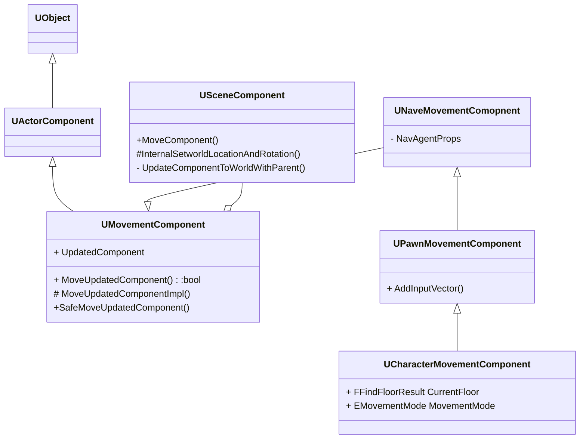

# Character Movement Component

>  Ref:  https://zhuanlan.zhihu.com/p/368613242
>
>  ​	     https://zhuanlan.zhihu.com/p/34257208

计算位置更新 *UpdatedComponent的位置

网络同步， 移动状态更新（flying, walking, ...），ROV避障

更改角色移动的两种：1. 给予初速度，2. 按 rootmotion 移动

## MovementComponet

作为移动组件的基类实现了基本的移动接口`SafeMoveUpdatedComponent`，更新UpdatedComponent 更新Actor的位置，

`MoveUpdatedCOmponent` 移动UpdatedComponent通过传入的Delta以及变更Rotation，调用`MoveUpdatedComponentImpl`

UpdatedComponent 类型为SceneComponent，该组件提供了最基本的位置信息，同时提供了改变自身以及其子组件的位置的接口InternalSetWorldLocationAndRotation()

## UNaveMovementComopnent

提供AI相关移动

## UPawnMovementComponent

提供与玩家互动的接口

`AddInputVector()`

一般的操作流程是，玩家通过InputComponent组件绑定一个按键操作，然后在按键响应时调用Pawn的AddMovementInput接口，进而调用移动组件的AddInputVector()，调用结束后会通过ConsumeMovementInputVector()接口消耗掉该次操作的输入数值，完成一次移动操作。

## UCharacterMovementComponetn

FFindFloorResult 角色当前所处地面信息

### 移动模式处理

EMovementMode总共8种枚举类型 (None, Walking, NavWalking, Falling, Swimming, Flying, Custom, Max) 其中None代表无法移动，NavWalking 用于AI移动，Falling 处理跳跃以及下落相关逻辑，Max 暂时不知道干啥
